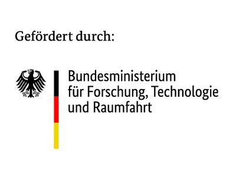

# TrainSpot – Lehrkompetenzen sichtbar machen und sich gezielt weiterbilden

Der TrainSpot ist ein digitaler Ort, an dem Lehrende ihren Kompetenzstand prüfen und dokumentieren sowie gezielte Empfehlungen zum Weiterlernen erhalten können. Für fertige Leistungen können sie sich zudem Badges ausstellen lassen.. Bildungsanbieter können im TrainSpot Ihre Lernangebote aus dem Bereich Train-the-Trainer anbinden und ihre Kompetenztests verknüpfen. 
Der TrainSpot ist erreichbar unter https://trainspot.besserweiterbilden.de   

## Veröffentlichter Code
In dieser GitHub-Organisation wird der Code des TrainSpots quelloffen bereitgestellt. 
- Das Kerntool für die Kurse und Lernempfehlungen ist die Dynamische Kompetenzbilanz, Sie finden sie [hier](https://github.com/train-the-trainer-hotspot/dkb)
- Kurse von Lernanbietern werden in einem eigenen Datenraum gespeichert. Diesen finden Sie [hier](https://github.com/train-the-trainer-hotspot/datenraum)
- Lernanbieter können Ihre Kurse KI-unterstützt auf den TrainSpot mappen lassen. Den Code für das Mapping-Tool finden Sie [hier](https://github.com/train-the-trainer-hotspot/mapping-tool)

## Förderung
Das Projekt Trainspot2 wurde durch öffentliche Gelder der eruopäischen Union und des Bundesministeriums für Forschung, Technologie und Raumfahrt gefördert

